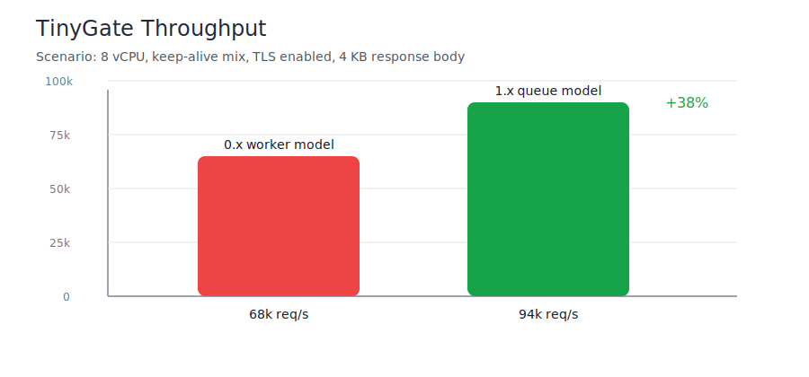
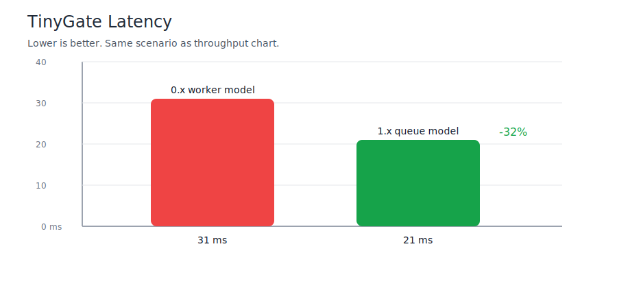

 
 

[](https://sibexi.co/support)

# TinyGate

TinyGate is a small reverse proxy written in C.
It accepts HTTP and HTTPS traffic and routes by Host header.

**This is an alpha version and it is not recommended for production use.**

**Documentation is in progress.**

Current platform support
- Linux with epoll and POSIX sockets
- FreeBSD with kqueue and POSIX sockets
- Windows with WSAPoll and Winsock

What it does
- Routes requests by domain
- Supports per-domain TLS certificates
- Uses SNI for certificate selection
- Can redirect HTTP to HTTPS per domain
- Caches backend address resolution at startup
- Uses a queue-based worker model with reusable per-thread buffers

Configuration

The config file has one global section and one section per domain.

**[proxy_settings]**
- listen_ip: address to bind, for example 0.0.0.0
- listen_port: HTTP port
- listen_ssl_port: HTTPS port, use 0 to disable TLS listener
- max_events: event batch size
- max_connections: connection cap used for backlog and limits
- io_buffer_size: request and relay buffer size in bytes
- host_buffer_size: Host header buffer size in bytes
- target_buffer_size: request target buffer size in bytes
- redirect_buffer_size: HTTPS redirect response buffer size in bytes

**[domain.name]**
- endpoint: backend endpoint in host:port form
- tls_cert_file: certificate path in PEM format
- tls_key_file: private key path in PEM format
- force_ssl: true or false

Example proxy.ini

```ini
[proxy_settings]
listen_ip = 0.0.0.0
listen_port = 80
listen_ssl_port = 443
max_events = 1024
max_connections = 8192
io_buffer_size = 16384
host_buffer_size = 256
target_buffer_size = 2048
redirect_buffer_size = 3072

[localhost]
endpoint = 127.0.0.1:8080
tls_cert_file =
tls_key_file =
force_ssl = false

[example.com]
endpoint = 127.0.0.1:8081
tls_cert_file = certs/example.com.crt
tls_key_file = certs/example.com.key
force_ssl = true
```

## Build with make

The project now includes a simple Makefile.

Native build:

```bash
make
```

Run tests:

```bash
make test
```

Build targets:

```bash
make linux-x86_64
make linux-arm64
make windows-x86_64
make freebsd-x86_64
```

You can override compiler variables when needed. Example:

```bash
make windows-x86_64 CC_WINDOWS_X86_64=x86_64-w64-mingw32-gcc
```


## Installation methods

### Install from archive

1. Download your platform archive from the release page.
2. Extract it.
3. Run TinyGate with your config file.

### Linux and FreeBSD example:

```bash
tar -xzf tinygate-<version>-linux-x86_64.tar.gz
./tinygate proxy.ini
```

### Windows example in PowerShell:

```powershell
tar -xf tinygate-<version>-windows-x86_64.tar.gz
.\tinygate.exe proxy.ini
```

### Install Debian package

```bash
sudo dpkg -i tinygate-<version>-linux-x86_64.deb
```

### Install RPM package

```bash
sudo rpm -ivh tinygate-<version>-linux-x86_64.rpm
```

### Install FreeBSD pkg package

```sh
sudo pkg add tinygate-<version>-freebsd-x86_64.pkg
```

Run after package install

```bash
/usr/local/bin/tinygate /path/to/proxy.ini
```


## Architecture change from 0.x to 1.x

Version 0.x was worker-based in a direct worker style.
The current version is queue-based.

0.x worker-based model
- Work acceptance and request processing were tightly coupled in worker flow.
- Buffer and connection work had higher contention under burst traffic.
- Tail latency rose faster during spikes.

1.x queue-based model
- Accept loop is separated from processing workers.
- Accepted sockets are pushed into a bounded task queue.
- Workers reuse preallocated buffers, reducing per-request allocation overhead.
- Load balancing between workers is more stable under burst traffic.

### Benchmark comparison

- 8 vCPU host
- TLS enabled
- Keep-alive mix
- 4 KB average response body
- Backend response already cached by backend service






